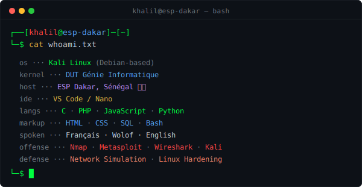

<!-- Profil GitHub - Khalil -->

<div align="center">

```
╔══════════════════════════════════════════════════════════════════╗
║              khalil@esp-dakar ~ kali-linux ~ zsh                 ║
╚══════════════════════════════════════════════════════════════════╝
```

</div>

---




<br clear="right"/>

---

## `// stack & outils`

<div align="center">


</div>

---

## `// projets`

| ID | Projet | Description | Stack |
|:--:|--------|-------------|-------|
| `[01]` | 🔐 **CyberSec Labs** | Pentesting — Nmap, Metasploit, Wireshark | `Kali Linux` |
| `[02]` | 📰 **La Tribune** | Site d'actualités avec CRUD sécurisé | `PHP` `MySQL` |
| `[03]` | 🌐 **eFootball Market** | Plateforme web de marché eFootball | `JS` `CSS` |
| `[04]` | 🖥️ **Student Manager** | Application de gestion étudiante | `C` |
| `[05]` | 🎓 **LibMANAGER** | Système de gestion de bibliothèque | `Merise/UML` |
| `[06]` | 🌍 **Portfolio** | Portfolio personnel dark mode | `HTML` `CSS` `JS` |

---

## `// objectifs 2025`

```python
# current_missions.py

targets = {
    "cybersec" : ["OSCP prep", "CTF challenges", "Bug bounty"],
    "web"      : ["React", "Node.js", "REST API"],
    "cloud"    : ["AWS basics", "Docker", "CI/CD"],
    "network"  : ["CCNA", "Packet Tracer advanced"],
}

for domain, missions in targets.items():
    print(f"[▶] {domain}: {', '.join(missions)}")
```


<div align="center">


```bash
┌──[khalil@esp-dakar]─[~]
└─$ echo "Always learning, always building."
Always learning, always building.
┌──[khalil@esp-dakar]─[~]
└─$ █
```

</div>
